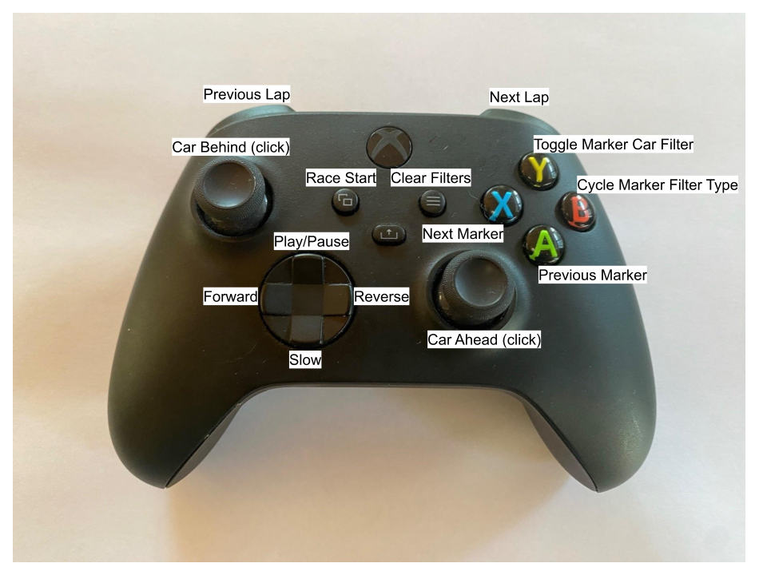

# RobertsmaniaPitGirl - iRacing Replay

This project presents a plugin for Voice Attack that integrates with the iRacing SDK to monitor race events and build a list of event markers to be used for replay review.

The iRacing telemetry data is monitored constantly and markers are recorded when any driver has an offtrack incident, overtake, undertake, or radio broadcast.  The race start and driver finishes are also entered as markers.

The replay marker data can be reviewed and filtered by car and/or marker type.  This makes it easy to go through the replay seeing all the events that were recorded for a specific car, all the events of a particular marker type for any car, or any marker type for any car.

For example:
* "Filter markers by the current car"
Then stepping forward or backward through the next/previous markers will keep the focus on the current car.  This alone is an improvement over the native iRacing next/previous incident review.

* "Filter markers by overtakes"
Then only overtake markers will be presented, and still focus will be on the current car.

* "Clear the marker filters"
Return to the default state of all marker types for all cars will be presented.

The provided profile has commands that can be used with speech, but is also intended to work with a gamepad/controller so the use of speech recognition is not required.

## Controller
This is the controller configuration I use, and what is in the provided VoiceAttack profile.  The goal is to make it easy to use the controller to review the replay data.  If you are not using voice commands, you will still need to interact with the standard iRacing UI to change cameras.  Also note that **NUMLOCK** on your keyboard will interfere with some of the controls, if things do not appear to be working try toggling NUMLOCK.



The analog stick and trigger inputs are not assigned.  You might experiment with mapping those to control the iRacing camera position/orientation to be able to fly the camera around as well. I've tried this with some success but your mileage may vary.

Of course you do not have to use a controller at all.  You can bind keyboard/mouse/speech to any command and configure your system however you like.

## Profile Commands
These are the high level commands in the provided profile:
<table cellpadding=0 cellspacing=0>
<thead>
<tr>
<th>Spoken Command</th>
<th>Button</th>
<th>Category<span id="sorttable_sortfwdind">&nbsp;▾</span></th>
</tr>
</thead>
<tbody>
<tr>
<td width='33%'><div style='max-height:4.8em;overflow:hidden'>Car ahead</div></td>
<td width='33%'><div style='max-height:4.8em;overflow:hidden'>Joystick 1 Button 10</div></td>
<td width='33%'><div style='max-height:4.8em;overflow:hidden'>A1 Replay Controller</div></td>
</tr>
<tr>
<td width='33%'><div style='max-height:4.8em;overflow:hidden'>Car behind</div></td>
<td width='33%'><div style='max-height:4.8em;overflow:hidden'>Joystick 1 Button 9</div></td>
<td width='33%'><div style='max-height:4.8em;overflow:hidden'>A1 Replay Controller</div></td>
</tr>
<tr>
<td width='33%'><div style='max-height:4.8em;overflow:hidden'>Cycle Marker [Type] Filter</div></td>
<td width='33%'><div style='max-height:4.8em;overflow:hidden'>Joystick 1 Button 2</div></td>
<td width='33%'><div style='max-height:4.8em;overflow:hidden'>A1 Replay Controller</div></td>
</tr>
<tr>
<td width='33%'><div style='max-height:4.8em;overflow:hidden'>End of recording</div></td>
<td width='33%'><div style='max-height:4.8em;overflow:hidden'></div></td>
<td width='33%'><div style='max-height:4.8em;overflow:hidden'>A1 Replay Controller</div></td>
</tr>
<tr>
<td width='33%'><div style='max-height:4.8em;overflow:hidden'>Fast forward</div></td>
<td width='33%'><div style='max-height:4.8em;overflow:hidden'>Joystick 1 POV 2</div></td>
<td width='33%'><div style='max-height:4.8em;overflow:hidden'>A1 Replay Controller</div></td>
</tr>
<tr>
<td width='33%'><div style='max-height:4.8em;overflow:hidden'>Frame backward</div></td>
<td width='33%'><div style='max-height:4.8em;overflow:hidden'></div></td>
<td width='33%'><div style='max-height:4.8em;overflow:hidden'>A1 Replay Controller</div></td>
</tr>
<tr>
<td width='33%'><div style='max-height:4.8em;overflow:hidden'>Frame forward</div></td>
<td width='33%'><div style='max-height:4.8em;overflow:hidden'></div></td>
<td width='33%'><div style='max-height:4.8em;overflow:hidden'>A1 Replay Controller</div></td>
</tr>
<tr>
<td width='33%'><div style='max-height:4.8em;overflow:hidden'>Next camera</div></td>
<td width='33%'><div style='max-height:4.8em;overflow:hidden'></div></td>
<td width='33%'><div style='max-height:4.8em;overflow:hidden'>A1 Replay Controller</div></td>
</tr>
<tr>
<td width='33%'><div style='max-height:4.8em;overflow:hidden'>Next iRacing incident</div></td>
<td width='33%'><div style='max-height:4.8em;overflow:hidden'></div></td>
<td width='33%'><div style='max-height:4.8em;overflow:hidden'>A1 Replay Controller</div></td>
</tr>
<tr>
<td width='33%'><div style='max-height:4.8em;overflow:hidden'>Next lap</div></td>
<td width='33%'><div style='max-height:4.8em;overflow:hidden'>Joystick 1 Button 6</div></td>
<td width='33%'><div style='max-height:4.8em;overflow:hidden'>A1 Replay Controller</div></td>
</tr>
<tr>
<td width='33%'><div style='max-height:4.8em;overflow:hidden'>Next marker</div></td>
<td width='33%'><div style='max-height:4.8em;overflow:hidden'>Joystick 1 Button 3</div></td>
<td width='33%'><div style='max-height:4.8em;overflow:hidden'>A1 Replay Controller</div></td>
</tr>
<tr>
<td width='33%'><div style='max-height:4.8em;overflow:hidden'>Play Pause</div></td>
<td width='33%'><div style='max-height:4.8em;overflow:hidden'>Joystick 1 POV 1</div></td>
<td width='33%'><div style='max-height:4.8em;overflow:hidden'>A1 Replay Controller</div></td>
</tr>
<tr>
<td width='33%'><div style='max-height:4.8em;overflow:hidden'>Previous camera</div></td>
<td width='33%'><div style='max-height:4.8em;overflow:hidden'></div></td>
<td width='33%'><div style='max-height:4.8em;overflow:hidden'>A1 Replay Controller</div></td>
</tr>
<tr>
<td width='33%'><div style='max-height:4.8em;overflow:hidden'>Previous iRacing incident</div></td>
<td width='33%'><div style='max-height:4.8em;overflow:hidden'></div></td>
<td width='33%'><div style='max-height:4.8em;overflow:hidden'>A1 Replay Controller</div></td>
</tr>
<tr>
<td width='33%'><div style='max-height:4.8em;overflow:hidden'>Previous lap</div></td>
<td width='33%'><div style='max-height:4.8em;overflow:hidden'>Joystick 1 Button 5</div></td>
<td width='33%'><div style='max-height:4.8em;overflow:hidden'>A1 Replay Controller</div></td>
</tr>
<tr>
<td width='33%'><div style='max-height:4.8em;overflow:hidden'>Previous marker</div></td>
<td width='33%'><div style='max-height:4.8em;overflow:hidden'>Joystick 1 Button 1</div></td>
<td width='33%'><div style='max-height:4.8em;overflow:hidden'>A1 Replay Controller</div></td>
</tr>
<tr>
<td width='33%'><div style='max-height:4.8em;overflow:hidden'>Race Start</div></td>
<td width='33%'><div style='max-height:4.8em;overflow:hidden'>Joystick 1 Button 7</div></td>
<td width='33%'><div style='max-height:4.8em;overflow:hidden'>A1 Replay Controller</div></td>
</tr>
<tr>
<td width='33%'><div style='max-height:4.8em;overflow:hidden'>Rewind</div></td>
<td width='33%'><div style='max-height:4.8em;overflow:hidden'>Joystick 1 POV 4</div></td>
<td width='33%'><div style='max-height:4.8em;overflow:hidden'>A1 Replay Controller</div></td>
</tr>
<tr>
<td width='33%'><div style='max-height:4.8em;overflow:hidden'>Show my car</div></td>
<td width='33%'><div style='max-height:4.8em;overflow:hidden'>Joystick 1 Button 9 + Joystick 1 Button 10</div></td>
<td width='33%'><div style='max-height:4.8em;overflow:hidden'>A1 Replay Controller</div></td>
</tr>
<tr>
<td width='33%'><div style='max-height:4.8em;overflow:hidden'>Slow motion</div></td>
<td width='33%'><div style='max-height:4.8em;overflow:hidden'>Joystick 1 POV 3</div></td>
<td width='33%'><div style='max-height:4.8em;overflow:hidden'>A1 Replay Controller</div></td>
</tr>
<tr>
<td width='33%'><div style='max-height:4.8em;overflow:hidden'>Toggle Car [Marker] Filter</div></td>
<td width='33%'><div style='max-height:4.8em;overflow:hidden'>Joystick 1 Button 4</div></td>
<td width='33%'><div style='max-height:4.8em;overflow:hidden'>A1 Replay Controller</div></td>
</tr>
<tr>
<td width='33%'><div style='max-height:4.8em;overflow:hidden'>Clear [the;] Marker Car [Filter;]</div></td>
<td width='33%'><div style='max-height:4.8em;overflow:hidden'></div></td>
<td width='33%'><div style='max-height:4.8em;overflow:hidden'>A2 Markers</div></td>
</tr>
<tr>
<td width='33%'><div style='max-height:4.8em;overflow:hidden'>Clear [the;] Marker [Filters; filter]</div></td>
<td width='33%'><div style='max-height:4.8em;overflow:hidden'>Joystick 1 Button 8</div></td>
<td width='33%'><div style='max-height:4.8em;overflow:hidden'>A2 Markers</div></td>
</tr>
<tr>
<td width='33%'><div style='max-height:4.8em;overflow:hidden'>Clear [the;] Marker Type [Filter;]</div></td>
<td width='33%'><div style='max-height:4.8em;overflow:hidden'></div></td>
<td width='33%'><div style='max-height:4.8em;overflow:hidden'>A2 Markers</div></td>
</tr>
<tr>
<td width='33%'><div style='max-height:4.8em;overflow:hidden'>Filter markers [by; for; with;] car number</div></td>
<td width='33%'><div style='max-height:4.8em;overflow:hidden'></div></td>
<td width='33%'><div style='max-height:4.8em;overflow:hidden'>A2 Markers</div></td>
</tr>
<tr>
<td width='33%'><div style='max-height:4.8em;overflow:hidden'>Filter Markers [by; for; with;] Incidents</div></td>
<td width='33%'><div style='max-height:4.8em;overflow:hidden'></div></td>
<td width='33%'><div style='max-height:4.8em;overflow:hidden'>A2 Markers</div></td>
</tr>
<tr>
<td width='33%'><div style='max-height:4.8em;overflow:hidden'>Filter Markers [by; for; with;] manual</div></td>
<td width='33%'><div style='max-height:4.8em;overflow:hidden'></div></td>
<td width='33%'><div style='max-height:4.8em;overflow:hidden'>A2 Markers</div></td>
</tr>
<tr>
<td width='33%'><div style='max-height:4.8em;overflow:hidden'>Filter markers [by; for; with;] [my car; me]</div></td>
<td width='33%'><div style='max-height:4.8em;overflow:hidden'></div></td>
<td width='33%'><div style='max-height:4.8em;overflow:hidden'>A2 Markers</div></td>
</tr>
<tr>
<td width='33%'><div style='max-height:4.8em;overflow:hidden'>Filter Markers [by; for; with;] Overtakes</div></td>
<td width='33%'><div style='max-height:4.8em;overflow:hidden'></div></td>
<td width='33%'><div style='max-height:4.8em;overflow:hidden'>A2 Markers</div></td>
</tr>
<tr>
<td width='33%'><div style='max-height:4.8em;overflow:hidden'>Filter Markers [by; for; with;] Radio [broadcasts; salt; chatter; talk; transmissions;]</div></td>
<td width='33%'><div style='max-height:4.8em;overflow:hidden'></div></td>
<td width='33%'><div style='max-height:4.8em;overflow:hidden'>A2 Markers</div></td>
</tr>
<tr>
<td width='33%'><div style='max-height:4.8em;overflow:hidden'>Filter markers [by; for; with;] [the;] [current; this] [car; driver]</div></td>
<td width='33%'><div style='max-height:4.8em;overflow:hidden'></div></td>
<td width='33%'><div style='max-height:4.8em;overflow:hidden'>A2 Markers</div></td>
</tr>
<tr>
<td width='33%'><div style='max-height:4.8em;overflow:hidden'>Filter Markers [by; for; with;] Undertakes</div></td>
<td width='33%'><div style='max-height:4.8em;overflow:hidden'></div></td>
<td width='33%'><div style='max-height:4.8em;overflow:hidden'>A2 Markers</div></td>
</tr>
<tr>
<td width='33%'><div style='max-height:4.8em;overflow:hidden'>[Marker summary; Summarize markers]</div></td>
<td width='33%'><div style='max-height:4.8em;overflow:hidden'></div></td>
<td width='33%'><div style='max-height:4.8em;overflow:hidden'>A2 Markers</div></td>
</tr>
<tr>
<td width='33%'><div style='max-height:4.8em;overflow:hidden'>Set [a; new;] marker</div></td>
<td width='33%'><div style='max-height:4.8em;overflow:hidden'></div></td>
<td width='33%'><div style='max-height:4.8em;overflow:hidden'>A2 Markers</div></td>
</tr>
<tr>
<td width='33%'><div style='max-height:4.8em;overflow:hidden'>[change; set;] [camera;] [to;] blimp [camera;]</div></td>
<td width='33%'><div style='max-height:4.8em;overflow:hidden'></div></td>
<td width='33%'><div style='max-height:4.8em;overflow:hidden'>A3 Cameras</div></td>
</tr>
<tr>
<td width='33%'><div style='max-height:4.8em;overflow:hidden'>[change; set;] [camera;] [to;] chase [camera;]</div></td>
<td width='33%'><div style='max-height:4.8em;overflow:hidden'></div></td>
<td width='33%'><div style='max-height:4.8em;overflow:hidden'>A3 Cameras</div></td>
</tr>
<tr>
<td width='33%'><div style='max-height:4.8em;overflow:hidden'>[change; set;] [camera;] [to;] cockpit [camera;]</div></td>
<td width='33%'><div style='max-height:4.8em;overflow:hidden'></div></td>
<td width='33%'><div style='max-height:4.8em;overflow:hidden'>A3 Cameras</div></td>
</tr>
<tr>
<td width='33%'><div style='max-height:4.8em;overflow:hidden'>[change; set;] [camera;] [to;] far chase [camera;]</div></td>
<td width='33%'><div style='max-height:4.8em;overflow:hidden'></div></td>
<td width='33%'><div style='max-height:4.8em;overflow:hidden'>A3 Cameras</div></td>
</tr>
<tr>
<td width='33%'><div style='max-height:4.8em;overflow:hidden'>[change; set;] [camera;] [to;] gearbox [camera;]</div></td>
<td width='33%'><div style='max-height:4.8em;overflow:hidden'></div></td>
<td width='33%'><div style='max-height:4.8em;overflow:hidden'>A3 Cameras</div></td>
</tr>
<tr>
<td width='33%'><div style='max-height:4.8em;overflow:hidden'>[change; set;] [camera;] [to;] gyro [camera;]</div></td>
<td width='33%'><div style='max-height:4.8em;overflow:hidden'></div></td>
<td width='33%'><div style='max-height:4.8em;overflow:hidden'>A3 Cameras</div></td>
</tr>
<tr>
<td width='33%'><div style='max-height:4.8em;overflow:hidden'>[change; set;] [camera;] [to;] left front [suspension;] [camera;]</div></td>
<td width='33%'><div style='max-height:4.8em;overflow:hidden'></div></td>
<td width='33%'><div style='max-height:4.8em;overflow:hidden'>A3 Cameras</div></td>
</tr>
<tr>
<td width='33%'><div style='max-height:4.8em;overflow:hidden'>[change; set;] [camera;] [to;] left rear [suspension;] [camera;]</div></td>
<td width='33%'><div style='max-height:4.8em;overflow:hidden'></div></td>
<td width='33%'><div style='max-height:4.8em;overflow:hidden'>A3 Cameras</div></td>
</tr>
<tr>
<td width='33%'><div style='max-height:4.8em;overflow:hidden'>[change; set;] [camera;] [to;] nose [camera;]</div></td>
<td width='33%'><div style='max-height:4.8em;overflow:hidden'></div></td>
<td width='33%'><div style='max-height:4.8em;overflow:hidden'>A3 Cameras</div></td>
</tr>
<tr>
<td width='33%'><div style='max-height:4.8em;overflow:hidden'>[change; set;] [camera;] [to;] pit lane 2 [camera;]</div></td>
<td width='33%'><div style='max-height:4.8em;overflow:hidden'></div></td>
<td width='33%'><div style='max-height:4.8em;overflow:hidden'>A3 Cameras</div></td>
</tr>
<tr>
<td width='33%'><div style='max-height:4.8em;overflow:hidden'>[change; set;] [camera;] [to;] pit lane [camera;]</div></td>
<td width='33%'><div style='max-height:4.8em;overflow:hidden'></div></td>
<td width='33%'><div style='max-height:4.8em;overflow:hidden'>A3 Cameras</div></td>
</tr>
<tr>
<td width='33%'><div style='max-height:4.8em;overflow:hidden'>[change; set;] [camera;] [to;] rear chase [camera;]</div></td>
<td width='33%'><div style='max-height:4.8em;overflow:hidden'></div></td>
<td width='33%'><div style='max-height:4.8em;overflow:hidden'>A3 Cameras</div></td>
</tr>
<tr>
<td width='33%'><div style='max-height:4.8em;overflow:hidden'>[change; set;] [camera;] [to;] right front [suspension;] [camera;]</div></td>
<td width='33%'><div style='max-height:4.8em;overflow:hidden'></div></td>
<td width='33%'><div style='max-height:4.8em;overflow:hidden'>A3 Cameras</div></td>
</tr>
<tr>
<td width='33%'><div style='max-height:4.8em;overflow:hidden'>[change; set;] [camera;] [to;] right rear [suspension;] [camera;]</div></td>
<td width='33%'><div style='max-height:4.8em;overflow:hidden'></div></td>
<td width='33%'><div style='max-height:4.8em;overflow:hidden'>A3 Cameras</div></td>
</tr>
<tr>
<td width='33%'><div style='max-height:4.8em;overflow:hidden'>[change; set;] [camera;] [to;] [rollbar; roll bar] [camera;]</div></td>
<td width='33%'><div style='max-height:4.8em;overflow:hidden'></div></td>
<td width='33%'><div style='max-height:4.8em;overflow:hidden'>A3 Cameras</div></td>
</tr>
<tr>
<td width='33%'><div style='max-height:4.8em;overflow:hidden'>[change; set;] [camera;] [to;] scenic [camera;]</div></td>
<td width='33%'><div style='max-height:4.8em;overflow:hidden'></div></td>
<td width='33%'><div style='max-height:4.8em;overflow:hidden'>A3 Cameras</div></td>
</tr>
<tr>
<td width='33%'><div style='max-height:4.8em;overflow:hidden'>[change; set;] [camera;] [to;] [the;] chopper [camera;]</div></td>
<td width='33%'><div style='max-height:4.8em;overflow:hidden'></div></td>
<td width='33%'><div style='max-height:4.8em;overflow:hidden'>A3 Cameras</div></td>
</tr>
<tr>
<td width='33%'><div style='max-height:4.8em;overflow:hidden'>[change; set;] [camera;] [to;] [tv 1; tv1] [camera;]</div></td>
<td width='33%'><div style='max-height:4.8em;overflow:hidden'></div></td>
<td width='33%'><div style='max-height:4.8em;overflow:hidden'>A3 Cameras</div></td>
</tr>
<tr>
<td width='33%'><div style='max-height:4.8em;overflow:hidden'>[change; set;] [camera;] [to;] [tv 2; tv2] [camera;]</div></td>
<td width='33%'><div style='max-height:4.8em;overflow:hidden'></div></td>
<td width='33%'><div style='max-height:4.8em;overflow:hidden'>A3 Cameras</div></td>
</tr>
<tr>
<td width='33%'><div style='max-height:4.8em;overflow:hidden'>[change; set;] [camera;] [to;] [tv 3; tv3] [camera;]</div></td>
<td width='33%'><div style='max-height:4.8em;overflow:hidden'></div></td>
<td width='33%'><div style='max-height:4.8em;overflow:hidden'>A3 Cameras</div></td>
</tr>
<tr>
<td width='33%'><div style='max-height:4.8em;overflow:hidden'>[change; set;] [camera;] [to;] TV mixed [camera;]</div></td>
<td width='33%'><div style='max-height:4.8em;overflow:hidden'></div></td>
<td width='33%'><div style='max-height:4.8em;overflow:hidden'>A3 Cameras</div></td>
</tr>
<tr>
<td width='33%'><div style='max-height:4.8em;overflow:hidden'>[change; set;] [camera;] [to;] TV static [camera;]</div></td>
<td width='33%'><div style='max-height:4.8em;overflow:hidden'></div></td>
<td width='33%'><div style='max-height:4.8em;overflow:hidden'>A3 Cameras</div></td>
</tr>
<tr>
<td width='33%'><div style='max-height:4.8em;overflow:hidden'>[jump; go; switch; watch; return; show] [to;] [the;] [race;] [start; beginning]</div></td>
<td width='33%'><div style='max-height:4.8em;overflow:hidden'></div></td>
<td width='33%'><div style='max-height:4.8em;overflow:hidden'>A4 Focus</div></td>
</tr>
<tr>
<td width='33%'><div style='max-height:4.8em;overflow:hidden'>[jump;go;switch;watch;return;show] [to;] [whats happening;] [live;real time;now;the present moment]</div></td>
<td width='33%'><div style='max-height:4.8em;overflow:hidden'></div></td>
<td width='33%'><div style='max-height:4.8em;overflow:hidden'>A4 Focus</div></td>
</tr>
<tr>
<td width='33%'><div style='max-height:4.8em;overflow:hidden'>[show; watch] most exciting</div></td>
<td width='33%'><div style='max-height:4.8em;overflow:hidden'></div></td>
<td width='33%'><div style='max-height:4.8em;overflow:hidden'>A4 Focus</div></td>
</tr>
<tr>
<td width='33%'><div style='max-height:4.8em;overflow:hidden'>Watch car number</div></td>
<td width='33%'><div style='max-height:4.8em;overflow:hidden'></div></td>
<td width='33%'><div style='max-height:4.8em;overflow:hidden'>A4 Focus</div></td>
</tr>
<tr>
<td width='33%'><div style='max-height:4.8em;overflow:hidden'>Watch car position</div></td>
<td width='33%'><div style='max-height:4.8em;overflow:hidden'></div></td>
<td width='33%'><div style='max-height:4.8em;overflow:hidden'>A4 Focus</div></td>
</tr>
<tr>
<td width='33%'><div style='max-height:4.8em;overflow:hidden'>Watch [my car; me]</div></td>
<td width='33%'><div style='max-height:4.8em;overflow:hidden'></div></td>
<td width='33%'><div style='max-height:4.8em;overflow:hidden'>A4 Focus</div></td>
</tr>
<tr>
<td width='33%'><div style='max-height:4.8em;overflow:hidden'>Watch [the;] car ahead</div></td>
<td width='33%'><div style='max-height:4.8em;overflow:hidden'></div></td>
<td width='33%'><div style='max-height:4.8em;overflow:hidden'>A4 Focus</div></td>
</tr>
<tr>
<td width='33%'><div style='max-height:4.8em;overflow:hidden'>Watch [the;] car behind</div></td>
<td width='33%'><div style='max-height:4.8em;overflow:hidden'></div></td>
<td width='33%'><div style='max-height:4.8em;overflow:hidden'>A4 Focus</div></td>
</tr>
<tr>
<td width='33%'><div style='max-height:4.8em;overflow:hidden'>Toggle [say soething; say nothing; speech]</div></td>
<td width='33%'><div style='max-height:4.8em;overflow:hidden'></div></td>
<td width='33%'><div style='max-height:4.8em;overflow:hidden'>A5 Speech</div></td>
</tr>
<tr>
<td width='33%'><div style='max-height:4.8em;overflow:hidden'>Toggle [say;] announcements</div></td>
<td width='33%'><div style='max-height:4.8em;overflow:hidden'></div></td>
<td width='33%'><div style='max-height:4.8em;overflow:hidden'>A5 Speech</div></td>
</tr>
<tr>
<td width='33%'><div style='max-height:4.8em;overflow:hidden'>Print Cameras</div></td>
<td width='33%'><div style='max-height:4.8em;overflow:hidden'></div></td>
<td width='33%'><div style='max-height:4.8em;overflow:hidden'>B1 Debug</div></td>
</tr>
<tr>
<td width='33%'><div style='max-height:4.8em;overflow:hidden'>Print Drivers</div></td>
<td width='33%'><div style='max-height:4.8em;overflow:hidden'></div></td>
<td width='33%'><div style='max-height:4.8em;overflow:hidden'>B1 Debug</div></td>
</tr>
<tr>
<td width='33%'><div style='max-height:4.8em;overflow:hidden'>Print Info</div></td>
<td width='33%'><div style='max-height:4.8em;overflow:hidden'></div></td>
<td width='33%'><div style='max-height:4.8em;overflow:hidden'>B1 Debug</div></td>
</tr>
<tr>
<td width='33%'><div style='max-height:4.8em;overflow:hidden'>Toggle num lock</div></td>
<td width='33%'><div style='max-height:4.8em;overflow:hidden'></div></td>
<td width='33%'><div style='max-height:4.8em;overflow:hidden'>C1 iRacing Keypress</div></td>
</tr>
<tr>
<td width='33%'><div style='max-height:4.8em;overflow:hidden'>[Initialize; reset; re-initialize] [Pit Girl;] [plugin; data;]</div></td>
<td width='33%'><div style='max-height:4.8em;overflow:hidden'></div></td>
<td width='33%'><div style='max-height:4.8em;overflow:hidden'>RobertsmaniaPitGirl Plugin Commands</div></td>
</tr>
</tbody>
</table>

This is a basic set of commands that demonstrates the features of the plugin.  Feel free to create your own, modify these or start from scratch.

## Speech

The provided profile does have the commands setup for speech recognition and it will have the system confirm things like camera changes with speech synthesis.

There are two boolean variables set on initialization that control the speech synthesis.  Both of those get set to true by default, but you can esaily change that in the Initialize command.

* SaySomething - Controls whether anything is said.  If this is true, the system will speak.  If it is false it will not say anything.
* SayAnnouncements - Secondary value to determine whether announcements like "Kris Robers had an Overtake" are made when replay markers are played (but if SaySomething is false, then SayAnnouncements has no effect).

In the default logic, announcemetns are made when there is no marker car filter and no marker type filter - it announces the driver and the marker type.  If the marker car filter is set but the maker types are on wildcard, it will announce the marker type.  If the marker type filter is set, it does not announce anything since that seems like it would get annoying to just call out driver names.  Feel free to modify the logic for speech to suit your taste.

Listening - the way I use the system, I have Voice Attack set to not listen by default.  That makes it so I can talk on stream about whatever and have no fear that it will accidently execute commands if I say words that would otherwise trigger actions.  In the profile options I specify "Pit Girl" on the Profile General tab as the value to "Override listening if my spoken command begins with:".  I encourage you to consider using a different name or identifier for your system.

## Plugin Commands

The plugin provides these commands to be used within a Voice Attack profile:
```
RobertsmaniaPitGirlReplay commands:

Print_Info
Print_Cameras
Print_Drivers
Set_Camera | {TXT:~~NewCamera}
Get_Camera | {TXT:~~HoldCamera}!
Watch_MyCar
Watch_MostExciting
Watch_CarNumber | {TXT:~~CarNumber}
Watch_CarPosition | {TXT:~~CarPosition}
Check_CarNumber | {TXT:~~CarNumber}!
Check_CarPosition | {TXT:~~CarPosition} {TXT:~~CarNumber}!
Jump_ToLive
Jump_ToBeginning
Marker_Add
PlayMarker_Next | {TXT:MarkerCarFilter} {TXT:MarkerTypeFilter} {INT:~~ReplayBufferSecs}
                | {TXT:~~MarkerDriver}! {TXT:~~MarkerType}!
PlayMarker_Previous | {TXT:MarkerCarFilter} {TXT:MarkerTypeFilter} {INT:~~ReplayBufferSecs}
                    | {TXT:~~MarkerDriver}! {TXT:~~MarkerType}!
PlayMarker_Last
PlayMarker_First
SeekMarker_First
iRacingIncident_Next
iRacingIncident_Previous
Marker_Count | {INT:~~MarkerCount}
Marker_Summary | {TXT:~~MarkerSummary}! {TXT:~~MostOvertakesCarNum}! 
                 {TXT:~~MostIncidentsCarNum}! {TXT:~~MostBroadcastsCarNum}!
                 {INT:~~IncidentMarkerCount}! {INT:~~OvertakeMarkerCount}!
                 {INT:~~RadioMarkerCount}! {INT:~~ManualMarkerCount}!
                 {INT:~~UndertakeMarkerCount}!
Marker_Summary_CarNumber | {TXT:~~CarNumber} {INT:~~CarNumberMarkerCount}!
                           {INT:~~CarNumberIncidentMarkerCount}! {INT:~~CarNumberOvertakeMarkerCount}!
                           {INT:~~CarNumberRadioMarkerCount}! {INT:~~CarNumberManualMarkerCount}!
                           {INT:~~CarNumberUndertakeMarkerCount}!
```

## Suggested Use
Start Voice Attack with the RobertsmaniaPitGirlReplay profile/plugin setup.

Join an iRacing session.

Participate.

Use the features of the profile/plugin to review the markers of events that happened in the race:

* Go to the start of the race
* Set the Marker Car Filter to follow your car
* Cycle through the race markers showing all the events recorded for your car
* Go back to the start
* Clear the Marker Filters
* Set the Marker Type Filter to something specific like Overtakes
* Cycle through the markers seeing all the overtakes in the session.
* Or whetever you like...

Leave that session and join anohter.  Repeat.  

Enjoy.

## Installation

You must own a license for Voice Attack to be able to use this (or any other) plugin: https://voiceattack.com

Download the RobertsmaniaPitGirlReplay.vax file from the [releases page](https://github.com/Robertsmania/RobertsmaniaPitGirl/releases) on this repository.

In the Voice Attack options, disable plugin support if it is currently enabled and restart Voice Attack.

Import the RobertsmaniaPitGirlReplay.vax.  This will install the plugin and sample profile.

Enable plugin support in the Voice Attack options.  Restart Voice Attack.

Select the RobertsmaniaPitGirlReplay profile.  The plugin should be initialized and the commands in the profile are available.

If you are new to Voice Attack, be sure to run through the training to get the windows speech recognition to recognize your voice.  Check out **Train your speech engine** and the other helpful tips: 
[Voice Attack Tips and How-To - https://voiceattack.com/howto.aspx](https://voiceattack.com/howto.aspx)
